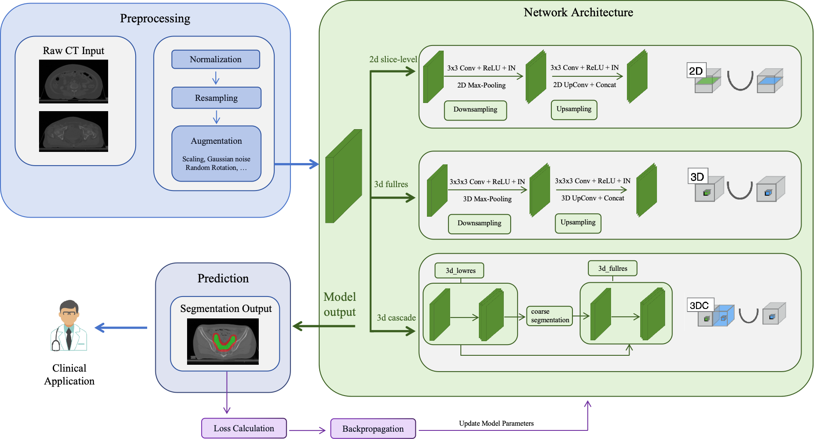

# UMTVSeg

The official repository of paper "Multicenter deep learning-based automatic delineation of CTV and PTV in uterine malignancy CT imaging" accepted by [Radiotherapy and Oncology](https://www.sciencedirect.com/science/article/abs/pii/S0167814025052168). 



## Usage

*  Our model was developen upon [nnUNet](https://github.com/MIC-DKFZ/nnUNet) with five-fold cross-validation. Please refer to the [official documentation](https://github.com/MIC-DKFZ/nnUNet/tree/master/documentation) for environment setup.
*  We release the checkpoints of our trained models which can be downloaded from [Google Drive](https://drive.google.com/drive/folders/1Kphc5yFCW6uRsRPYpAS3phy4twSZumFc?usp=share_link).
*  After completing the environment setup and downloading the checkpoints, use the following command for segmentation. 
```
nnUNetv2_predict -i INPUT_FOLDER -o OUTPUT_FOLDER -d DATASET_NAME_OR_ID -c CONFIGURATION --save_probabilities
```
*  Refer to [here](https://github.com/MIC-DKFZ/nnUNet/blob/master/documentation/how_to_use_nnunet.md) for more usage details.


## Acknowledgment

If you find this repository helpful, please consider citing:
```
@article{xu2025multicenter,
  title={Multicenter deep learning-based automatic delineation of CTV and PTV in uterine malignancy CT imaging},
  author={Xu, Bichun and Liu, Jun and Fang, Mingming and Zhu, Hong and Zhang, Yichi and Zhang, Hongwei and Lu, Xujing and Luo, Judong},
  journal={Radiotherapy and Oncology},
  pages={111212},
  year={2025},
  publisher={Elsevier}
}
```
